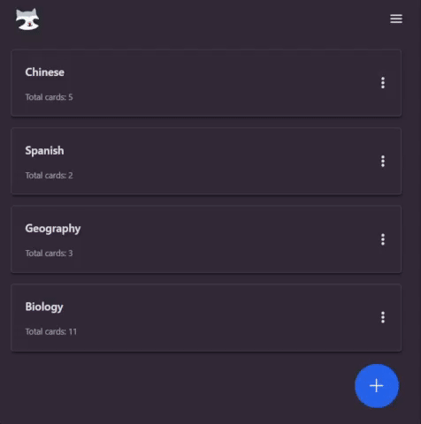

## Technology Stack and Features

- **Backend:**
    - [**FastAPI**](https://fastapi.tiangolo.com) for the Python backend API.
        - [SQLModel](https://sqlmodel.tiangolo.com) for ORM-based SQL database interactions.
        - [Pydantic](https://docs.pydantic.dev) for data validation and settings management.
        - [PostgreSQL](https://www.postgresql.org) as the SQL database.
- **Frontend:**
    - [**React**](https://react.dev) with TypeScript, hooks, and Vite for a modern frontend stack.
        - [Chakra UI](https://chakra-ui.com) for UI components.
        - Generated client for consuming the backend API.
- **Authentication:**
    - JWT (JSON Web Token) authentication.
- **Testing:**
    - [Pytest](https://pytest.org) for backend testing.

Explore the API documentation at [http://127.0.0.1:8000/docs](http://127.0.0.1:8000/docs).



## How to Run it!

### Backend

```
createdb <dbname>
# Set the environment variables in the .env file
cd backend
poetry install
# Run ./prestart.sh to run db migrations
poetry run ./prestart.sh 
poetry run uvicorn src.main:app --reload
```

### Frontend
```
cd frontend
pnpm install
pnpm run dev
```